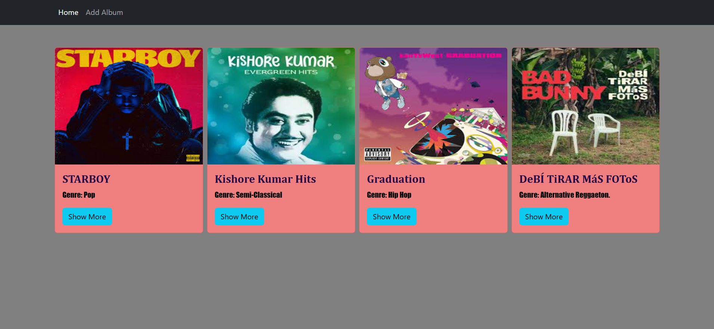
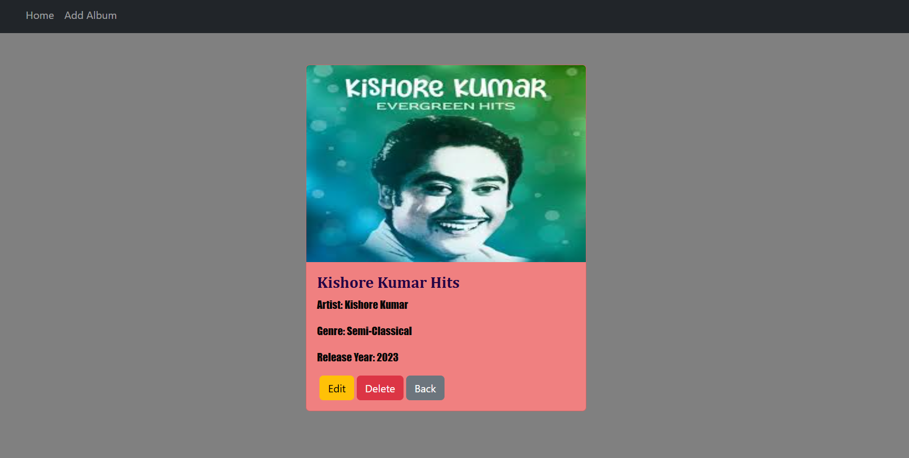
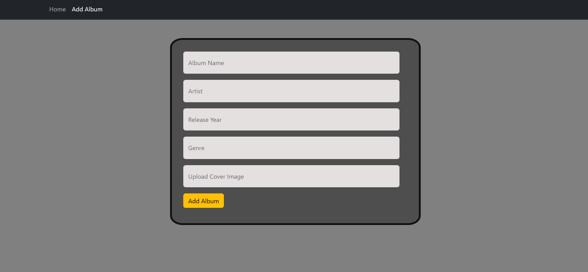
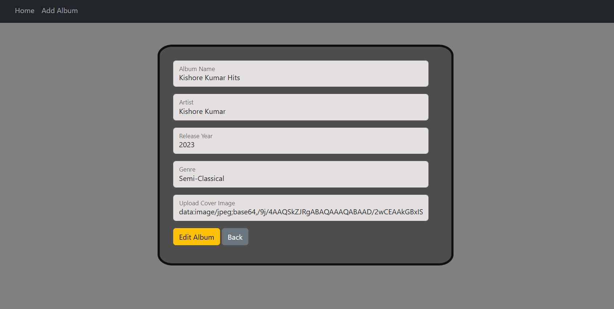

# 🎵 MUSIC-ALBUM-MANAGER

A full-stack web application to manage music albums where users can add, view, update, and delete album details.

---

## 🚀 Features
- Add new music albums
- View all albums
- Edit album details
- Delete albums
- Responsive user interface

---

## 🛠️ Tech Stack
**Frontend:** React.js, Bootstrap  
**Backend:** Node.js, Express.js  
**Database:** MongoDB  

---

## 📸 Project Screenshots

### 🏠 Home Page

---

### 📀 Show All Albums

---

### ➕ Add Album

---

### ✏️ Edit Album

---

